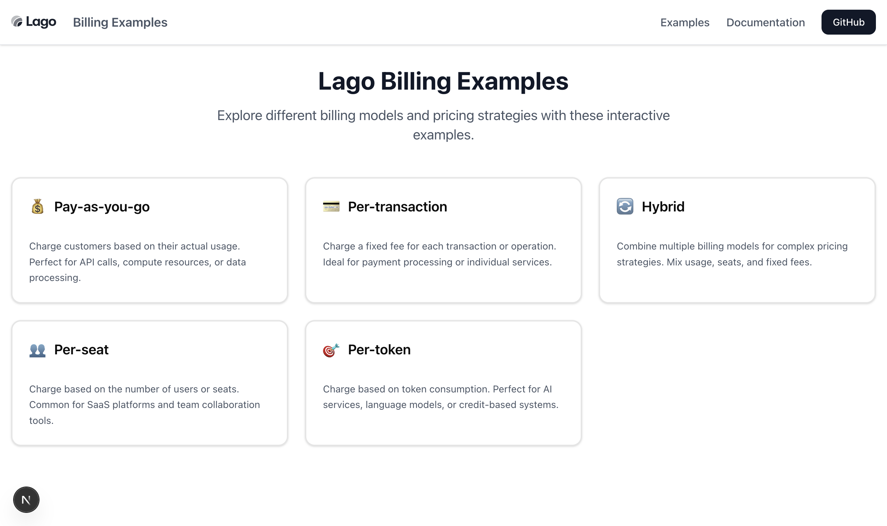

<div align="center" style="background-color: white;">
  
</div>

# Lago Billing Examples

Interactive demos showcasing different billing models using [Lago's](https://getlago.com) JavaScript SDK. This Next.js application demonstrates real-time usage tracking and event-driven billing for modern SaaS applications.



## 🎯 Features

- **Pay-as-you-go** - Charge customers based on actual usage (API calls, compute resources)
- **Per-transaction** - Fixed fee per transaction or operation
- **Hybrid billing** - Combine multiple billing models for complex pricing
- **Per-seat** - User-based pricing for team collaboration tools
- **Per-token** - Token consumption billing for AI services and credit systems

## 🛠 Prerequisites

Active [Lago](https://getlago.com) account with API access

## 📦 Installation

1. **Clone the repository**
   ```bash
   git clone https://github.com/getlago/lago-billing-examples.git
   cd lago-billing-examples
   ```

2. **Install dependencies**
   ```bash
   npm install
   # or
   yarn install
   # or
   pnpm install
   ```

3. **Environment setup**
   Create a `.env` file in the root directory:
   ```env
   LAGO_API_KEY=your_lago_api_key_here
   ```

4. **Start the development server**
   ```bash
   npm run dev
   ```

5. **Open your browser**
   Navigate to [http://localhost:3000](http://localhost:3000)

## 📁 Folder Structure

```
src/
├── app/
│   ├── (examples)/          # Lago billing example pages
│   │   ...       
│   ├── api/
│   │   ├── (events)/        # Lago event creation endpoints
│   │   │   ...
│   │   └── cus-usage/       # Customer usage endpoint
│   ├── globals.css
│   ├── layout.tsx
│   └── page.tsx
├── components/
│   ├── ui/                  # Shadcn UI components
│   │   ...           
└── lib/
    ├── lagoClient.ts        # Lago JS SDK client initialization
    ├── constants.ts         # Customer/subscription IDs
    └── utils.ts             # Utility functions
```

## 🔑 Key Code Snippets

### Lago Client Setup
```typescript
// src/lib/lagoClient.ts
import { Client } from 'lago-javascript-client';

const apiKey = process.env.LAGO_API_KEY!;
const lagoClient = Client(apiKey);

export default lagoClient;
```

### Creating Usage Events
```typescript
// src/app/api/(events)/payg-usage/route.ts
import lagoClient from '@/lib/lagoClient';

export async function POST(request: Request) {
  const body = await request.json();
  
  const response = await lagoClient.events.createEvent({
    event: {
      transaction_id: crypto.randomUUID(),
      external_subscription_id: EXTERNAL_SUBSCRIPTION_ID,
      code: '__BILLABLE_METRIC_CODE__', // Your billable metric code
      timestamp: Math.floor(Date.now() / 1000).toString(),
      properties: {
        // Insert trackable event properties (e.x. input or output tokens)
      },
    },
  });
  
  return NextResponse.json(response.data);
}
```

### Fetching Customer Usage
```typescript
// src/app/api/cus-usage/route.ts
const response = await lagoClient.customers.findCustomerCurrentUsage(
  EXTERNAL_CUSTOMER_ID,
  { external_subscription_id }
);
```

## 🚀 Usage

1. **Configure your Lago setup**: Update the constants in `src/lib/constants.ts` with your actual customer and subscription IDs
2. **Explore billing models**: Click on any billing model card to see the interactive demo
3. **Test usage events**: Adjust usage amounts and click "Send event" to see real-time billing
4. **View responses**: Monitor event responses and customer usage data in the JSON viewers

## 🐛 Troubleshooting

### Common Issues

**"Lago event failed" error**
- Verify your `LAGO_API_KEY` is set correctly in `.env`
- Check that your Lago account has API access enabled
- Ensure customer and subscription IDs exist in your Lago instance

**Usage data not loading**
- Update `EXTERNAL_CUSTOMER_ID` and `EXTERNAL_SUBSCRIPTION_ID` in `src/lib/constants.ts`
- Verify the subscription is active in your Lago dashboard

**Build errors**
- Run `npm install` to ensure all dependencies are installed
- Check Node.js version (requires 18+)

## 🔗 Links

- [Lago Documentation](https://getlago.com/docs)
- [Lago JavaScript SDK](https://github.com/getlago/lago-javascript-client)

## 📄 License

This project is licensed under the MIT License - see the [LICENSE](LICENSE) file for details.

---

Built with ❤️ by the [Lago](https://getlago.com) team
